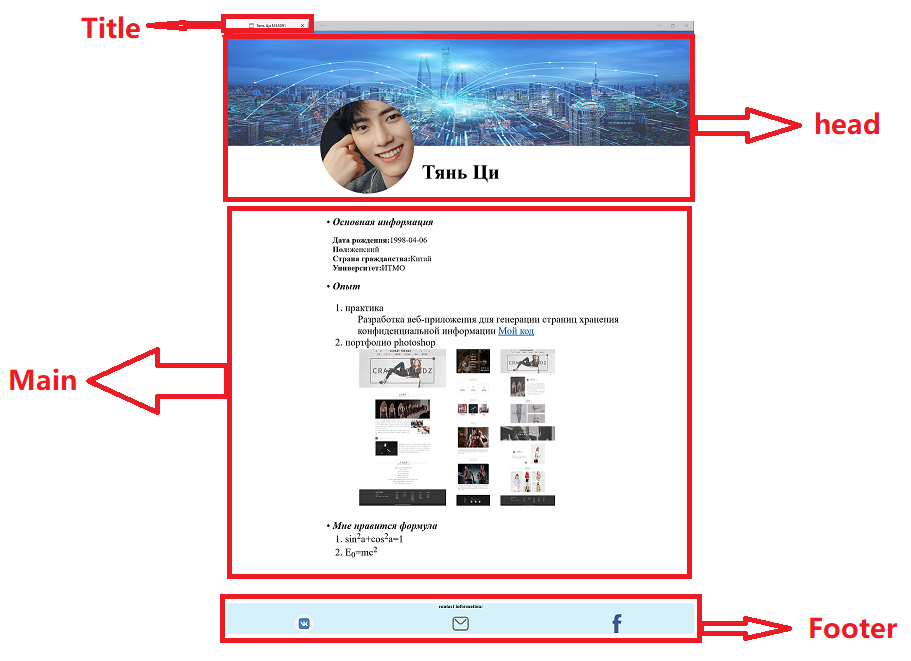

# Lab1
***View:***
  > 
## ***How to run your fail***
  - click on file myweb.html
## Step by step:
  > - new project -> Java Enterprise -> web Application
   >> 
      
  > -  new -> HTML
   >> 
      
  > - new -> stylesheet
   >> 
      
